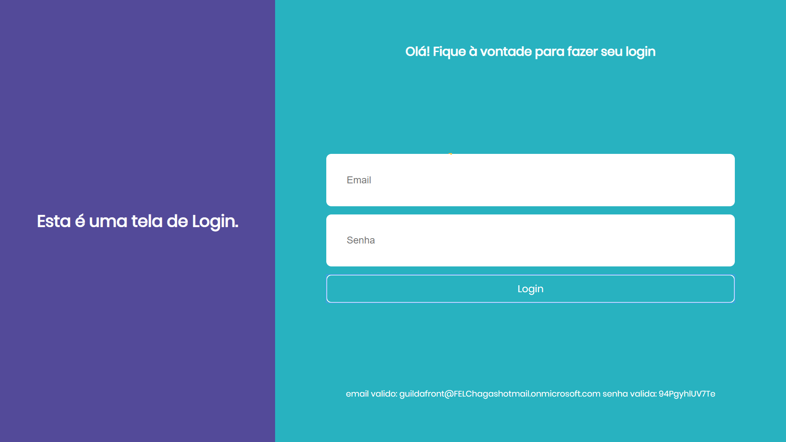

# LoginScreen
Teste prático Front End



# Observações: 
## Extensão
Caso esteja usando o Google Chrome, para que a pagina funcione corretamente é preciso ativar a extensão "Allow CORS: Access-Control-Allow-Origin"

Disponibilizada no Link abaixo: 
[Allow CORS](https://chrome.google.com/webstore/detail/allow-cors-access-control/lhobafahddgcelffkeicbaginigeejlf)

Para funcionar, basta selecionar o icone no canto superior direito do navegador e clicar no simbolo da extensão.

### Desativado 

### Ativado


Caso contratrio, o erro retornado será o seguinte:

```
Access to fetch at 'https://login.microsoftonline.com/be87ed09-e753-468f-8244-e2f3811ceacc/oauth2/v2.0/token' from origin 'null' has been blocked by CORS policy: Response to preflight request doesn't pass access control check: No 'Access-Control-Allow-Origin' header is present on the requested resource. If an opaque response serves your needs, set the request's mode to 'no-cors' to fetch the resource with CORS disabled.
```


# Conclusão: 
Muito obrigada pela oportunidade, espero que gostem (:
